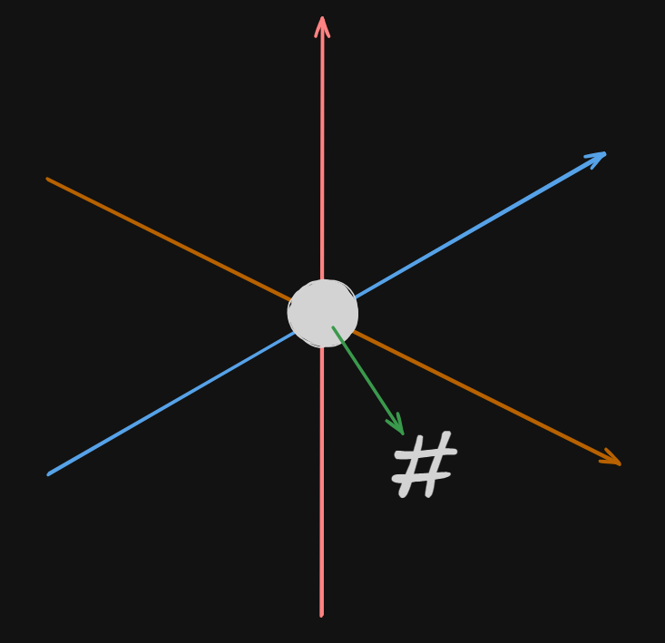

# Spatial Hasher

A Rust library for deterministic encryption and decryption using 3D spatial parameters with secure authenticated encryption.

## Table of Contents

- [Overview](#overview)
- [Features](#features)
- [Installation](#installation)
- [Usage](#usage)
  - [Creating a Spatial Hasher Instance](#creating-a-spatial_hasher-instance)
  - [Encrypting Data](#encrypting-data)
  - [Decrypting Data](#decrypting-data)
- [Example](#example)
- [Testing](#testing)
- [Dependencies](#dependencies)
- [Security Considerations](#security-considerations)
- [Disclaimer](#disclaimer)
- [Contributing](#contributing)
- [License](#license)

## Overview

`spatial_hasher` provides a way to encrypt and decrypt data using a deterministic algorithm based on 3D spatial parameters. It utilizes a combination of a 3D point, a rotation axis, the number of iterations, and a strength parameter to derive a cryptographic key using SHA-256 hashing. This key is then used with the ChaCha20-Poly1305 authenticated encryption algorithm to ensure secure encryption and decryption.



## Features

- **Secure Authenticated Encryption**: Uses the ChaCha20-Poly1305 algorithm for strong encryption and integrity protection.
- **Deterministic Key Derivation**: Generates a consistent key from spatial parameters, allowing for reproducible encryption and decryption.
- **Customizable Parameters**: Adjust the starting point, rotation axis, iterations, and strength to modify the encryption.
- **Simple API**: Easy to integrate into other Rust projects.
- **Serialization Support**: Structures can be serialized and deserialized using `serde`.

## Installation

Add `spatial_hasher` to your `Cargo.toml` dependencies:

```toml
[dependencies]
spatial_hasher = "0.1.0"
```

## Usage
First, import the necessary structs:

```rust
use spatial_hasher::{Point3D, RotationAxis, Spha256};
```

## Creating a spatial_hasher Instance
Create a spatial_hasher instance by specifying the starting point, rotation axis, number of iterations, and strength:

```rust
let point = Point3D { x: 1.0, y: 2.0, z: 3.0 };
let rotation_axis = RotationAxis { x: 0.0, y: 1.0, z: 0.0 };
let iterations = 10;
let strength = 0.1;

let hasher = Spha256::new(point, rotation_axis, iterations, strength);
```

## Encrypting Data
Encrypt data by passing a byte slice to the encrypt method:

```rust
let data = b"Secret Message";
let encrypted_data = hasher.encrypt(data);
```

## Decrypting Data
Decrypt data by passing the encrypted byte slice to the decrypt method:

```rust
let decrypted_data = hasher.decrypt(&encrypted_data).expect("Decryption failed");
assert_eq!(data, &decrypted_data[..]);
```

## Example
Below is a complete example demonstrating how to use spatial_hasher:

```rust
use spatial_hasher::{Point3D, RotationAxis, Spha256};

fn main() {
    // Define the starting point and rotation axis
    let point = Point3D {
        x: 1.0,
        y: 2.0,
        z: 3.0,
    };
    let rotation_axis = RotationAxis {
        x: 0.0,
        y: 1.0,
        z: 0.0,
    };
    let iterations = 10;
    let strength = 0.1;

    // Create a new Spha256 instance
    let hasher = Spha256::new(point, rotation_axis, iterations, strength);

    // Original data to be encrypted
    let original_data = b"Hello, World!";
    println!("Original Data: {:?}", String::from_utf8_lossy(original_data));

    // Encrypt the data
    let encrypted = hasher.encrypt(original_data);
    println!("Encrypted Data: {:?}", encrypted);

    // Decrypt the data
    let decrypted = hasher.decrypt(&encrypted).expect("Decryption failed");
    println!("Decrypted Data: {:?}", String::from_utf8_lossy(&decrypted));

    // Verify that the decrypted data matches the original data
    assert_eq!(original_data, &decrypted[..], "Decryption failed");
}
```

Output:
```yaml
Original Data: "Hello, World!"
Encrypted Data: [ ... ]
Decrypted Data: "Hello, World!"
```

## Testing
Run the unit tests included with spatial_hasher using:

```bash
cargo test
```

## Dependencies
`spatial_hasher` relies on the following crates:

- `rand` for random number generation.
- `chacha20poly1305` for the ChaCha20-Poly1305 cipher.
- `serde` for serialization and deserialization.
- `sha2` for SHA-256 hashing.

## Security Considerations

`spatial_hasher` now uses the ChaCha20-Poly1305 authenticated encryption algorithm, which provides strong security guarantees for both confidentiality and integrity. The encryption key is derived deterministically from the input parameters using SHA-256 hashing.

### Important Notes:

- **Key Confidentiality**: The security of the encryption relies on the secrecy of the parameters (`Point3D`, `RotationAxis`, `iterations`, and `strength`) used to derive the key. Keep these parameters confidential and secure.
- **Nonce Management**: A unique random nonce is generated for each encryption operation and is prepended to the ciphertext. Do not reuse encrypted data with the nonce removed or altered.
- **Parameter Uniqueness**: Using unique parameters for different encryption contexts enhances security by ensuring different keys are used.

While `spatial_hasher` provides robust encryption, it's crucial to follow best practices in key management and security to maintain the confidentiality and integrity of your data.

## Disclaimer
### Disclaimer of Warranty

The software Spatial Hasher is provided "as is", without warranty of any kind, express or implied, including but not limited to the warranties of merchantability, fitness for a particular purpose, and noninfringement. In no event shall the authors or contributors be liable for any claim, damages, or other liability, whether in an action of contract, tort, or otherwise, arising from, out of, or in connection with the software or the use or other dealings in the software.

### Limitation of Liability

Under no circumstances shall the authors or contributors be liable for any indirect, incidental, special, exemplary, or consequential damages (including, but not limited to, procurement of substitute goods or services; loss of use, data, or profits; or business interruption) however caused and on any theory of liability, whether in contract, strict liability, or tort (including negligence or otherwise) arising in any way out of the use of this software, even if advised of the possibility of such damage.

### No Responsibility for Misuse

The users of Spatial Hasher are solely responsible for compliance with all applicable laws and regulations, including but not limited to data encryption laws and export controls. The authors and contributors shall not be held responsible for any misuse of the software that may result in violation of any laws or regulations.

### Not Intended for High-Risk Activities

This software is not designed, intended, or authorized for use in any type of system or application where the failure of the software could create a situation where personal injury or death may occur (e.g., life-support systems, emergency services, nuclear facilities, or aircraft navigation or communication systems). The users agree that they will not use or redistribute the software for such purposes.

### No Obligation to Support

The authors and contributors have no obligation to provide maintenance, support, updates, enhancements, or modifications to the software. Any such support provided shall be at the sole discretion of the authors and contributors.

### Acceptance of Terms

By using Spatial Hasher, you signify your acceptance of this disclaimer. If you do not agree to this disclaimer, you must not use the software.

### Final Statement

`spatial_hasher` should not be used for encrypting sensitive or confidential data. The encryption provided is suitable for obfuscation or simple data hiding in contexts where strong security is not required. Use at your own risk.

For applications requiring robust, secure encryption, please use established cryptographic libraries such as the [RustCrypto](https://github.com/RustCrypto) collection of crates.

## Contributing
Contributions are welcome! Please follow these steps:

1. Fork the repository.
2. Create a new branch for your feature or bugfix.
3. Write tests for any new functionality.
4. Submit a pull request with a detailed description of your changes.

## License
This project is licensed under the MIT License. See the LICENSE file for details.
